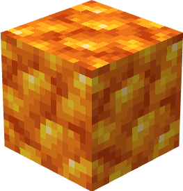

# Блок рудного цитрину

Це блок, що дорівнює 9 одиницям [рудного цитрину](../materialy/metally-i-mineraly/rudnyi-citrin.md).

<figure><figcaption></figcaption></figure>

## Отримання

#### _Руйнування_

Блок рудного цитрину видобувається лише алмазною чи незеритової киркою.

#### _Крафт_

<figure><figcaption></figcaption></figure>

## Використання

Блоки рудного цитрину використовуються для компактного зберігання [рудного цитрину](../materialy/metally-i-mineraly/rudnyi-citrin.md).

## Як інгредієнт при крафті

<figure><figcaption></figcaption></figure>
