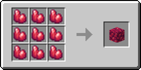

# Блок рудного драгоніту

Це блок, що дорівнює 9 одиницям [рудного драгоніту](../materialy/metally-i-mineraly/rudnyi-dragonit.md).

<figure><figcaption></figcaption></figure>

## Отримання

#### _Руйнування_

Блок рудного драгоніту видобувається лише алмазною чи незеритовою киркою.

#### _Крафт_

<figure><figcaption></figcaption></figure>

## Використання

Блоки рудного драгоніту використовуються для компактного зберігання [рудного драгоніту](../materialy/metally-i-mineraly/rudnyi-dragonit.md).

## Як інгредієнт при крафті

<figure><figcaption></figcaption></figure>
