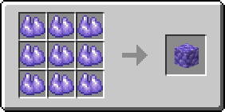

# Блок рудного танзаніту

Це блок, що дорівнює 9 одиницям [рудного танзаніту](../materialy/metally-i-mineraly/rudnyi-tanzanit.md).

<figure><figcaption></figcaption></figure>

## Отримання

#### _Руйнування_

Блок рудного танзаніту видобувається лише алмазною чи незеритовою киркою.

#### _Крафт_

<figure><figcaption></figcaption></figure>

## Використання

Блоки танзаніту використовуються для компактного зберігання [рудного танзаніту](../materialy/metally-i-mineraly/rudnyi-tanzanit.md).

## Як інгредієнт при крафті

<figure><figcaption></figcaption></figure>