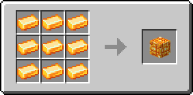

# Цитриновий блок

Блок, який можна отримати з 9 [цитринових злитків](../materialy/metally-i-mineraly/citrinovyi-slitok.md), і навпаки. Використовується для компактного зберігання [цитринових злитків](../materialy/metally-i-mineraly/citrinovyi-slitok.md) та в будівлях.

<figure><figcaption></figcaption></figure>

## Отримання

#### _Руйнування_

Цитриновий блок видобувається лише алмазною чи незеритовою киркою.

#### _Крафт_

<figure><figcaption></figcaption></figure>

## Використання

Цитриновий блок можна перетворити на [цитринові зливки](../materialy/metally-i-mineraly/citrinovyi-slitok.md).

## Як інгредієнт при крафті

<figure><figcaption></figcaption></figure>
