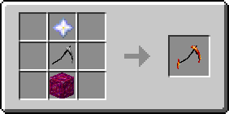

# Покращений драгонітовий блок

<figure><figcaption></figcaption></figure>

## Отримання

#### _Руйнування_

Покращений драгонітовий блок видобувається лише алмазною або незеритовою киркою.

#### _Крафт_

|                                                                                                                                       | Поліпшений драгонітовий блок                                                                   |
| ------------------------------------------------------------------------------------------------------------------------------------- | ---------------------------------------------------------------------------------------------- |
| 
<a href="dragonitovyi-blok.md">Драгонітовий блок</a> + <a href="../essencii/pylayushaya-essenciya.md">Палаюча есенція</a>
   |  |

## Як інгредієнт при крафті

|                                                                                                                                                         | Тьмяно палаюча Коса                                                                         |
| ------------------------------------------------------------------------------------------------------------------------------------------------------- | ------------------------------------------------------------------------------------------- |
| 
Звезда Незера + <a href="../nabory-broni/nabor-broni-plameni/kosa-plameni/#ugasshaya-kosa">Згасла Коса</a> + Поліпшений драгонітовий блок
  |  |
