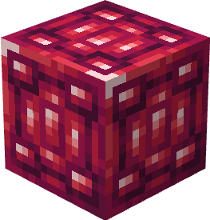
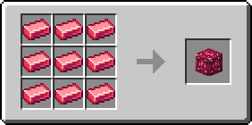

# Драгонітовий блок

Блок, який можна отримати з 9 [драгонітових злитків](../materialy/metally-i-mineraly/dragonitovyi-slitok.md), і навпаки. Використовується для компактного зберігання [драгонітових злитків](../materialy/metally-i-mineraly/dragonitovyi-slitok.md) та в будівлях.

<figure><figcaption></figcaption></figure>

## Отримання

#### _Руйнування_

Драгонітовий блок видобувається лише алмазною або незеритовою киркою.

#### _Крафт_

<figure><figcaption></figcaption></figure>

## Використання

Драгонітовий блок можна перетворити на [драгонітові зливки](../materialy/metally-i-mineraly/dragonitovyi-slitok.md).

## Як інгредієнт при крафті

<figure><figcaption></figcaption></figure>

|                                                                                                    | Покращений драгонітовий блок                                                                   |
| -------------------------------------------------------------------------------------------------- | ---------------------------------------------------------------------------------------------- |
| 
Драгонітовий блок + <a href="../essencii/pylayushaya-essenciya.md">Палаюча есенція</a>
   |  |
