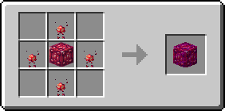

# Драгонитовый блок

Блок, который можно получить из 9 [драгонитовых слитков](../materialy/metally-i-mineraly/dragonitovyi-slitok.md), и наоборот. Используется для компактного хранения [драгонитовых слитков](../materialy/metally-i-mineraly/dragonitovyi-slitok.md) и в постройках.

<figure><figcaption></figcaption></figure>

## Получение

#### _Разрушение_

Драгонитовый блок добывается только алмазной или незеритовой киркой.

#### _Крафт_

<figure><figcaption></figcaption></figure>

## Использование

Драгонитовый блок можно превратить в [драгонитовые слитки](../materialy/metally-i-mineraly/dragonitovyi-slitok.md).

## Как ингредиент при крафте

<figure><figcaption></figcaption></figure>

|                                                                                                    | Улучшенный драгонитовый блок                                                                   |
| -------------------------------------------------------------------------------------------------- | ---------------------------------------------------------------------------------------------- |
| 
Драгонитовый блок + <a href="../essencii/pylayushaya-essenciya.md">Пылающая эссенция</a>
 |  |
