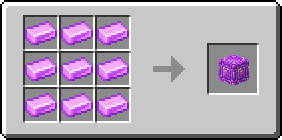
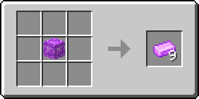

# Кунцитовый блок

Блок, который можно получить из 9 [кунцитовых слитков](../materialy/metally-i-mineraly/kuncitovyi-slitok.md), и наоборот. Используется для компактного хранения [кунцитовых слитков](../materialy/metally-i-mineraly/kuncitovyi-slitok.md) и в постройках.

<figure><figcaption></figcaption></figure>

## Получение

#### _Разрушение_

Кунцитовый блок добывается только алмазной или незеритовой киркой.

#### _Крафт_

<figure><figcaption></figcaption></figure>

## Использование

Кунцитовый блок можно превратить в [кунцитовые слитки](../materialy/metally-i-mineraly/kuncitovyi-slitok.md).

## Как ингредиент при крафте

<figure><figcaption></figcaption></figure>
