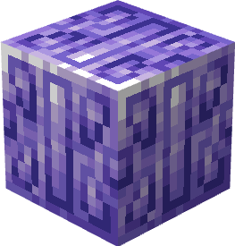
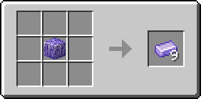

# Танзанітовий блок

Блок, який можна отримати з 9 [танзанітових злитків](../materialy/metally-i-mineraly/tanzanitovyi-slitok.md), і навпаки. Використовується для компактного зберігання [танзанітових злитків](../materialy/metally-i-mineraly/tanzanitovyi-slitok.md) та в будівлях.

<figure><figcaption></figcaption></figure>

## Отримання

#### _Руйнування_

Танзанітовий блок видобувається тільки алмазною або незеритової киркою.

#### _Крафт_

<figure><figcaption></figcaption></figure>

## Використання

Танзанітовий блок можна перетворити на [танзанітові зливки](../materialy/metally-i-mineraly/tanzanitovyi-slitok.md).

## Як інгредієнт при крафті

<figure><figcaption></figcaption></figure>