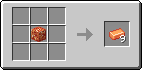

# Топазовий блок

Блок, який можна отримати з 9 [топазових злитків](../materialy/metally-i-mineraly/topazovyi-slitok.md), і навпаки. Використовується для компактного зберігання [топазових злитків](../materialy/metally-i-mineraly/topazovyi-slitok.md) та в будівлях.

<figure><figcaption></figcaption></figure>

## Отримання

#### _Руйнування_

Топазовий блок видобувається лише алмазною чи незеритовою киркою.

#### _Крафт_

<figure><figcaption></figcaption></figure>

## Використання

Топазовий блок можна перетворити на [топазові зливки](../materialy/metally-i-mineraly/topazovyi-slitok.md).

## Як інгредієнт при крафті

<figure><figcaption></figcaption></figure>
