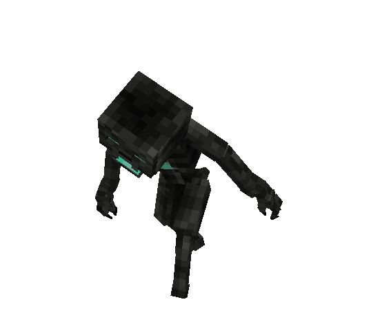

# Осквернённый Рыскун

<figure><figcaption></figcaption></figure>

## Спаун

Верхний мир (ночь):

* [Болото](https://minecraft.fandom.com/ru/wiki/%D0%91%D0%BE%D0%BB%D0%BE%D1%82%D0%BE) :link:
* [Мангровое болото](https://minecraft.fandom.com/ru/wiki/%D0%9C%D0%B0%D0%BD%D0%B3%D1%80%D0%BE%D0%B2%D0%BE%D0%B5\_%D0%B1%D0%BE%D0%BB%D0%BE%D1%82%D0%BE) :link:
* [Пустошь](https://minecraft.fandom.com/ru/wiki/%D0%9F%D1%83%D1%81%D1%82%D0%BE%D1%88%D1%8C) :link:
* [Выветренная пустошь](https://minecraft.fandom.com/ru/wiki/%D0%92%D1%8B%D0%B2%D0%B5%D1%82%D1%80%D0%B5%D0%BD%D0%BD%D0%B0%D1%8F\_%D0%BF%D1%83%D1%81%D1%82%D0%BE%D1%88%D1%8C) :link:
* [Тёмные глубины](https://minecraft.fandom.com/ru/wiki/%D0%A2%D1%91%D0%BC%D0%BD%D1%8B%D0%B5\_%D0%B3%D0%BB%D1%83%D0%B1%D0%B8%D0%BD%D1%8B) :link:

Нижний мир:

* [Долина песка душ](https://minecraft.fandom.com/ru/wiki/%D0%94%D0%BE%D0%BB%D0%B8%D0%BD%D0%B0\_%D0%BF%D0%B5%D1%81%D0%BA%D0%B0\_%D0%B4%D1%83%D1%88) :link:
* [Базальтовые дельты](https://minecraft.fandom.com/ru/wiki/%D0%91%D0%B0%D0%B7%D0%B0%D0%BB%D1%8C%D1%82%D0%BE%D0%B2%D1%8B%D0%B5\_%D0%B4%D0%B5%D0%BB%D1%8C%D1%82%D1%8B) :link:

## Дроп

* [саронитовый страз](../../materialy/saronitovyi-straz.md) с шансом 9%
* [сгусток шлака](../../materialy/sgustok-shlaka.md) с шансом 4%
* [чумная кость](../../materialy/chumnaya-kost.md) с шансом 20%
