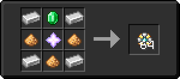
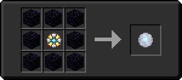

# Квазар

<figure><figcaption></figcaption></figure>

## Получение

#### _Крафт_

| ㅤ                                                                              |  Квазар                                 |
| ------------------------------------------------------------------------------ | --------------------------------------- |
| 
Железный слиток + Звезда Незера + Изумруд + Светокаменная пыль
 |  |

## Использование

#### _Как ингредиент при крафте_

#### [Звездная вспышка](star_flare.md)

| ㅤ                                                                            |  Звездная вспышка                          |
| ---------------------------------------------------------------------------- | ------------------------------------------ |
| 
Осколок эха + Огненный заряд + <a href="catalyst.md">Квазар</a>
 |  |

#### [Адское ядро](gobber2_goo_nether.md)

| ㅤ                                                                                                                                      |  Адское ядро                                        |
| -------------------------------------------------------------------------------------------------------------------------------------- | --------------------------------------------------- |
| 
<a href="weak_arcana_potion.md">Зелье Арканы</a> + <a href="catalyst.md">Квазар</a> + Незерский кирпич + Сгусток магмы
 |  |

#### [Драгоценный камень неба](perk_gem_sky.md)

| ㅤ                                                                                    |  Драгоценный камень неба                      |
| ------------------------------------------------------------------------------------ | --------------------------------------------- |
| 
Пиротехническая звезда + <a href="catalyst.md">Квазар</a> + Слеза гаста
 |  |

#### [Темная звезда Нижнего мира](dark_nether_star.md)

| ㅤ                                                                       |  Темная звезда Нижнего мира                       |
| ----------------------------------------------------------------------- | ------------------------------------------------- |
| 
<a href="dark.md">Тьма</a> + <a href="catalyst.md">Квазар</a>
 |  |

#### [Сердечник для инфузии крови](blood_infusion_core.md)

| ㅤ                                                            |  Сердечник для инфузии крови                         |
| ------------------------------------------------------------ | ---------------------------------------------------- |
| 
Железный слиток + <a href="catalyst.md">Квазар</a>
 |  |

#### [Пустое сердце](heart_empty.md)

| ㅤ                                                                                    |  Пустое сердце                              |
| ------------------------------------------------------------------------------------ | ------------------------------------------- |
| 
Незеритовый слиток + <a href="catalyst.md">Квазар</a> + Железный слиток
 |  |

#### [Камень солнца](sunstone.md)

| ㅤ                                                  |  Камень солнца                          |
| -------------------------------------------------- | --------------------------------------- |
| 
<a href="catalyst.md">Квазар</a> + Магма
 |  |

#### [Камень луны](moonstone.md)

| ㅤ                                                     |  Камень луны                             |
| ----------------------------------------------------- | ---------------------------------------- |
| 
<a href="catalyst.md">Квазар</a> + Обсидиан
 |  |

#### [Драконья звезда](dragon_star.md)

| ㅤ                                                                                                                               |  Драконья звезда                            |
| ------------------------------------------------------------------------------------------------------------------------------- | ------------------------------------------- |
| 
Кристалл Энда + <a href="catalyst.md">Квазар</a> + <a href="aquatic_dragon_scale.md">Совершенная чешуя дракона</a>
 |  |

#### [Звезда Эндера](ender_star.md)

| ㅤ                                                                                                                                                |  Звезда Эндера                             |
| ------------------------------------------------------------------------------------------------------------------------------------------------ | ------------------------------------------ |
| 
<a href="enderite_ingot.md">Слиток эндерита</a> + <a href="catalyst.md">Квазар</a> + <a href="purple_blaze.md">Фиолетовое пламя</a>
 |  |

