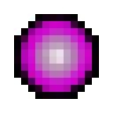
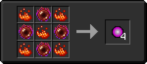

# Дислокатор

<figure><figcaption></figcaption></figure>

## Получение

#### _Крафт_

| ㅤ                                                                                                                      |  Дислокатор                               |
| ---------------------------------------------------------------------------------------------------------------------- | ----------------------------------------- |
| 
<a href="blood_pearl_of_teleportation.md">Кровавая жемчужина</a> + <a href="fury_fire.md">Яростный огонь</a>
 |  |

## Использование

#### _Как ингредиент при крафте_

#### [Волшебный слиток](fairy_ingot.md)

| ㅤ                                                                                                                    |  Волшебный слиток                           |
| -------------------------------------------------------------------------------------------------------------------- | ------------------------------------------- |
| 
Незер-кварц + <a href="weak_arcana_potion.md">Зелье Арканы</a> + <a href="dislocator.md">Дислокатор</a>
 |  |

#### [Шар восхождения](ascent_projectile.md)

| ㅤ                                                                                        |  Шар восхождения                                  |
| ---------------------------------------------------------------------------------------- | ------------------------------------------------- |
| 
<a href="acid.md">Кислотная капля</a> + <a href="dislocator.md">Дислокатор</a>
 |  |

