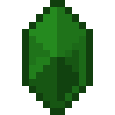

# Отличный камень земли

<figure><figcaption></figcaption></figure>

## Получение

#### _Крафт_

| ㅤ                                                                                                                                        |  Отличный камень земли                          |
| ---------------------------------------------------------------------------------------------------------------------------------------- | ----------------------------------------------- |
| 
<a href="powerful_earth_shard.md">Мощный камень земли</a> + <a href="fireite_ingot.md">Огненный слиток</a> + Огненный заряд
 |  |

## Использование

#### _Как ингредиент при крафте_

#### [Чистый камень земли](pristine_earth_gem.md)

| ㅤ                                                                                                                       |  Чистый камень земли                                |
| ----------------------------------------------------------------------------------------------------------------------- | --------------------------------------------------- |
| 
<a href="fine_earth_gem.md">Отличный камень земли</a> + <a href="spawner_seeker.md">Пространственное ядро</a>
 |  |

