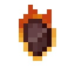

# Огненный самородок

<figure><figcaption></figcaption></figure>

## Получение

#### _Крафт_

| ㅤ                                                                                   |  Огненный самородок                            |
| ----------------------------------------------------------------------------------- | ---------------------------------------------- |
| 
Кремень + <a href="fury_fire.md">Яростный огонь</a> + Незерский кирпич
 |  |

## Использование

#### _Как ингредиент при крафте_

#### [Огненный слиток](fireite_ingot.md)

| ㅤ                                                         |  Огненный слиток                              |
| --------------------------------------------------------- | --------------------------------------------- |
| 
<a href="fireite_nugget.md">Огненный самородок</a>
 |  |

