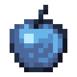

# Мертвое зачарованное яблоко

<figure><figcaption></figcaption></figure>

## Получение

#### _Крафт_

| ㅤ                                                                                                            |  Мертвое зачарованное яблоко                         |
| ------------------------------------------------------------------------------------------------------------ | ---------------------------------------------------- |
| 
<a href="ectoplasm.md">Эктоплазма</a> + Яблоко + <a href="purple_blaze.md">Фиолетовое пламя</a>
 |  |

## Использование

#### _Как ингредиент при крафте_

#### [Адское зачарованное яблоко](gobber2_gooey_apple_nether.md)

| ㅤ                                                                                                                            |  Адское зачарованное яблоко                                  |
| ---------------------------------------------------------------------------------------------------------------------------- | ------------------------------------------------------------ |
| 
<a href="gobber2_goo_nether.md">Адское ядро</a> + <a href="gobber2_gooey_apple.md">Мертвое зачарованное яблоко</a>
 |  |

