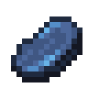

# Мертвая зачарованная говядина

<figure><figcaption></figcaption></figure>

## Получение

#### _Крафт_

| ㅤ                                                                                                                    |  Мертвая зачарованная говядина                      |
| -------------------------------------------------------------------------------------------------------------------- | --------------------------------------------------- |
| 
<a href="ectoplasm.md">Эктоплазма</a> + Сырая говядина + <a href="purple_blaze.md">Фиолетовое пламя</a>
 |  |

## Использование

#### _Как ингредиент при крафте_

#### [Адская зачарованная говядина](gobber2_gooey_beef_nether.md)

| ㅤ                                                                                                                             |  Адская зачарованная говядина                               |
| ----------------------------------------------------------------------------------------------------------------------------- | ----------------------------------------------------------- |
| 
<a href="gobber2_goo_nether.md">Адское ядро</a> + <a href="gobber2_gooey_beef.md">Мертвая зачарованная говядина</a>
 |  |

