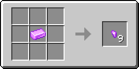
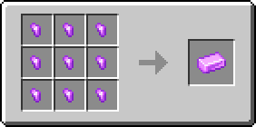

# Кусочек кунцита

Материал, использующийся для создания различных предметов. Один кусочек кунцита фактически является 1/9 частью [кунцитового слитка](kuncitovyi-slitok.md).

<figure><figcaption></figcaption></figure>

## Получение

#### _Руды_

Кусочки кунцита могут выпасть при добыче [кунцитовой руды](../../rudy/kuncitovaya-ruda.md).

#### _Крафт_

<figure><figcaption></figcaption></figure>

## Использование

#### _Как ингредиент при крафте_

<figure><figcaption></figcaption></figure>
