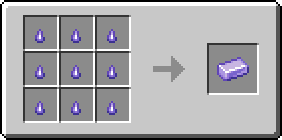

# Кусочек танзанита

Материал, использующийся для создания различных предметов. Один кусочек танзанита фактически является 1/9 частью [танзанитового слитка](tanzanitovyi-slitok.md).

<figure><figcaption></figcaption></figure>

## Получение

#### _Руды_

Кусочки танзанита могут выпасть при добыче [танзанитовой руды](../../rudy/tanzanitovaya-ruda.md).

#### _Крафт_

<figure><figcaption></figcaption></figure>

## Использование

#### _Как ингредиент при крафте_

<figure><figcaption></figcaption></figure>
