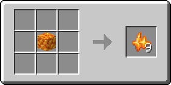
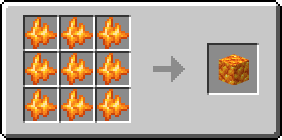
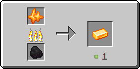

# Рудный цитрин

Предмет, выпадающий в результате добывания [цитриновой руды](../../rudy/citrinovaya-ruda.md).

<figure><figcaption></figcaption></figure>

## Получение

#### _Добывание_

Одна единица рудного цитрина выпадает в результате добывания [цитриновой руды](../../rudy/citrinovaya-ruda.md).


Инструменты с зачарованием _**Удача**_** ** не будут работать на [цитриновой руде](../../rudy/citrinovaya-ruda.md)



Инструменты с зачарованием _**Шёлковое касание**_ будут добывать [цитриновую руду](../../rudy/citrinovaya-ruda.md), вместо рудного цитрина


#### _Крафт_

<figure><figcaption></figcaption></figure>

## Использование

Рудный цитрин можно переплавить в [цитриновый слиток](citrinovyi-slitok.md).

#### _Как ингредиент для крафта_

<figure><figcaption></figcaption></figure>

#### _Плавка_

<figure><figcaption></figcaption></figure>
