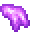
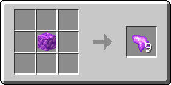
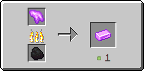

# Рудный кунцит

Предмет, выпадающий в результате добывания [кунцитовой руды](../../rudy/kuncitovaya-ruda.md).

<figure><figcaption></figcaption></figure>

## Получение

#### _Добывание_

Одна единица рудного кунцита выпадает в результате добывания [кунцитовой руды](../../rudy/kuncitovaya-ruda.md).


Инструменты с зачарованием _**Удача**_ не будут работать на [кунцитовой руде](../../rudy/kuncitovaya-ruda.md)



Инструменты с зачарованием _**Шёлковое касание**_ будут добывать [кунцитовую руду](../../rudy/kuncitovaya-ruda.md), вместо рудного кунцита


#### _Крафт_

<figure><figcaption></figcaption></figure>

## Использование

Рудный кунцит можно переплавить в [кунцитовый слиток](kuncitovyi-slitok.md).

#### _Как ингредиент для крафта_

<figure><figcaption></figcaption></figure>

#### _Плавка_

<figure><figcaption></figcaption></figure>
