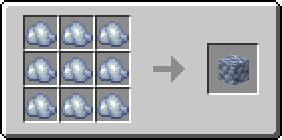

# Рудный лабрадорит

Предмет, выпадающий в результате добывания [лабрадоритовой руды](../../rudy/labradoritovaya-ruda.md).

<figure><figcaption></figcaption></figure>

## Получение

#### _Добывание_

Одна единица рудного лабрадорита выпадает в результате добывания [лабрадоритовой руды](../../rudy/labradoritovaya-ruda.md).


Инструменты с зачарованием _**Удача**_ не будут работать на [лабрадоритовой руде](../../rudy/labradoritovaya-ruda.md)



Инструменты с зачарованием _**Шёлковое касание**_ будут добывать [лабрадоритовую руду](../../rudy/labradoritovaya-ruda.md), вместо рудного лабрадорита


#### _Крафт_

<figure><figcaption></figcaption></figure>

## Использование

Рудный лабрадорит можно переплавить в [лабрадоритовый слиток](labradoritovyi-slitok.md).

#### _Как ингредиент для крафта_

<figure><figcaption></figcaption></figure>

#### _Плавка_

<figure><figcaption></figcaption></figure>
