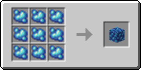
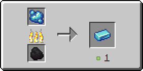

# Рудный сапфир

Предмет, выпадающий в результате добывания [сапфировой руды](../../rudy/sapfirovaya-ruda.md).

<figure><figcaption></figcaption></figure>

## Получение

#### _Добывание_

Одна единица рудного сапфира выпадает в результате добывания [сапфировой руды](../../rudy/sapfirovaya-ruda.md).


Инструменты с зачарованием _**Удача**_** ** не будут работать на[ сапфировой руде](../../rudy/sapfirovaya-ruda.md)



Инструменты с зачарованием _**Шёлковое касание**_ будут добывать [сапфировую руду](../../rudy/sapfirovaya-ruda.md), вместо рудного сапфира


#### _Крафт_

<figure><figcaption></figcaption></figure>

## Использование

Сапфировую руду можно переплавить в [сапфировый слиток](sapfirovyi-slitok.md).

#### _Как ингредиент для крафта_

<figure><figcaption></figcaption></figure>

#### _Плавка_

<figure><figcaption></figcaption></figure>
