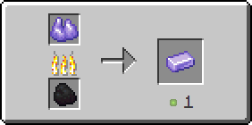

# Рудный танзанит

Предмет, выпадающий в результате добывания [танзанитовой руды](../../rudy/tanzanitovaya-ruda.md).

<figure><figcaption></figcaption></figure>

## Получение

#### _Добывание_

Одна единица рудного кунцита выпадает в результате добывания [танзанитовой руды](../../rudy/tanzanitovaya-ruda.md).


Инструменты с зачарованием _**Удача**_ не будут работать на [танзанитовой руде](../../rudy/tanzanitovaya-ruda.md)



Инструменты с зачарованием _**Шёлковое касание**_ будут добывать [танзанитовую руду](../../rudy/tanzanitovaya-ruda.md), вместо рудного танзанита


#### _Крафт_

<figure><figcaption></figcaption></figure>

## Использование

Рудный танзанит можно переплавить в [танзанитовый слиток](tanzanitovyi-slitok.md).

#### _Как ингредиент для крафта_

<figure><figcaption></figcaption></figure>

#### _Плавка_

<figure><figcaption></figcaption></figure>
