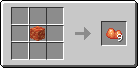
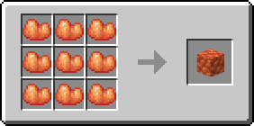
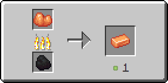

# Рудный топаз

Предмет, выпадающий в результате добывания [топазовой руды](../../rudy/topazovaya-ruda.md).

<figure><figcaption></figcaption></figure>

## Получение

#### _Добывание_

Одна единица рудного топаза выпадает в результате добывания [топазовой руды](../../rudy/topazovaya-ruda.md).


Инструменты с зачарованием _**Удача**_ не будут работать на [топазовой руде](../../rudy/topazovaya-ruda.md)



Инструменты с зачарованием _**Шёлковое касание**_ будут добывать [топазовую руду](../../rudy/topazovaya-ruda.md), вместо рудного топаза


#### _Крафт_

<figure><figcaption></figcaption></figure>

## Использование

Рудный топаз можно переплавить в [топазовый слиток](topazovyi-slitok.md).

#### _Как ингредиент для крафта_

<figure><figcaption></figcaption></figure>

#### _Плавка_

<figure><figcaption></figcaption></figure>
