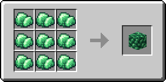
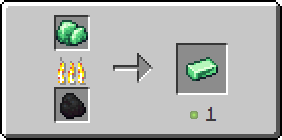

# Рудный турмалин

Предмет, выпадающий в результате добывания [турмалиновой руды](../../rudy/turmalinovaya-ruda.md).

<figure><figcaption></figcaption></figure>

## Получение

#### _Добывание_

Одна единица рудного турмалина выпадает в результате добывания [турмалиновой руды](../../rudy/turmalinovaya-ruda.md).


Инструменты с зачарованием _**Удача**_** ** не будут работать на [турмалиновой руде](../../rudy/turmalinovaya-ruda.md)



Инструменты с зачарованием _**Шёлковое касание**_ будут добывать [турмалиновую руду](../../rudy/turmalinovaya-ruda.md), вместо рудного турмалина


#### _Крафт_

<figure><figcaption></figcaption></figure>

## Использование

[Рудный турмалин](rudnyi-turmalin.md) можно переплавить в [турмалиновый слиток](turmalinovyi-slitok.md).

#### _Как ингредиент для крафта_

<figure><figcaption></figcaption></figure>

#### _Плавка_

<figure><figcaption></figcaption></figure>
