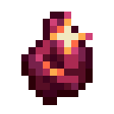

# Огрубевший сердолик

<figure><figcaption></figcaption></figure>

## Получение

#### _Крафт_

| ㅤ                                                                             | Огрубевший сердолик                                               |
| ----------------------------------------------------------------------------- | ----------------------------------------------------------------- |
| 
Рудное золото + Рудное железо + Незеритовый лом + Рудная медь
 |  |

## Использование

#### _Как ингредиент при крафте_

#### [Пробужденный сердолик](ogrubevshii-serdolik.md#probuzhdennyi-serdolik)

| ㅤ                   | Пробужденный сердолик                                               |
| ------------------- | ------------------------------------------------------------------- |
| Огрубевший сердолик |  |
