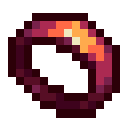

# Отшлифованный перстень

<figure><figcaption></figcaption></figure>

## Получение

#### _Крафт_

| ㅤ                                                  | Отшлифованный перстень                                         |
| -------------------------------------------------- | -------------------------------------------------------------- |
| [Пробужденный сердолик](probuzhdennyi-serdolik.md) |  |

## Использование

#### _Как ингредиент при крафте_

[Обработанный жаром перстень](obrabotannyi-zharom-persten.md)

| ㅤ                                                                                                                                                                                                    | Обработанный жаром перстень                                         |
| ---------------------------------------------------------------------------------------------------------------------------------------------------------------------------------------------------- | ------------------------------------------------------------------- |
| 
<a href="fury_fire.md">Яростный огонь</a> + <a href="otshlifovannyi-persten.md">Отшлифованный перстень</a> + <a href="../essencii/tainstvennaya-essenciya.md">Таинственная эссенция</a>
 |  |
