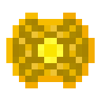

# Руническая дуга

<figure><figcaption></figcaption></figure>

## Получение

#### _Крафт_

| ㅤ                                                                                                                                  |  Руническая дуга                          |
| ---------------------------------------------------------------------------------------------------------------------------------- | ----------------------------------------- |
| 
Золотой слиток + <a href="fireite_ingot.md">Огненный слиток</a> + <a href="xp_crystal_4.md">Кристалл опыта 5  ур.</a>
 |  |

## Использование

#### _Как ингредиент при крафте_

#### [Разрушительная душа монстра](basemonstersoul_destructive.md)

| ㅤ                                                                                                                                                                                                                                                                             |  Разрушительная душа монстра                                |
| ----------------------------------------------------------------------------------------------------------------------------------------------------------------------------------------------------------------------------------------------------------------------------- | ----------------------------------------------------------- |
| 
<a href="purple_blaze.md">Фиолетовое пламя</a> + <a href="runic_arc.md">Руническая дуга</a> + <a href="sentientarmourgem_destructive_activated.md">Активированный камень разрушительной разумной брони</a> + <a href="weak_arcana_potion.md">Зелье Арканы</a>
 |  |

