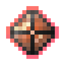

# Активированный камень мстительной разумной брони

<figure><figcaption></figcaption></figure>

## Получение

#### _Крафт_

| ㅤ                                                                                                                                                    |  Активированный камень мстительной разумной брони                     |
| ---------------------------------------------------------------------------------------------------------------------------------------------------- | --------------------------------------------------------------------- |
| 
<a href="purple_blaze.md">Фиолетовое пламя</a> + <a href="sentientarmourgem_vengeful_deactivated.md">Камень мстительной разумной брони</a>
 |  |

## Использование

#### _Как ингредиент при крафте_

#### [Мстительная душа монстра](basemonstersoul_vengeful.md)

| ㅤ                                                                                                                                                                                                                                                            |  Мстительная душа монстра                                |
| ------------------------------------------------------------------------------------------------------------------------------------------------------------------------------------------------------------------------------------------------------------ | -------------------------------------------------------- |
| 
<a href="purple_blaze.md">Фиолетовое пламя</a> + <a href="hitchak.md">Хитчак</a> + <a href="sentientarmourgem_vengeful_activated.md">Активированный камень мстительной разумной брони</a> + <a href="weak_arcana_potion.md">Зелье Арканы</a>
 |  |

