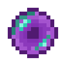

# Пространственное ядро

<figure><figcaption></figcaption></figure>

## Получение

#### _Крафт_

| ㅤ                                                                                                                                                             | Пространственное ядро                          |
| ------------------------------------------------------------------------------------------------------------------------------------------------------------- | ---------------------------------------------- |
| 
<a href="corrupted_bullet.md">Испорченная пуля</a> + <a href="crocus_petals.md">Лепестки крокуса</a> + <a href="dusk_arc.md">Сумеречная дуга</a>
 |  |

## Использование

#### _Как ингредиент при крафте_

#### [Компонент пространственной ячейки 1 ур.](spatial\_cell\_component\_2.md)

| ㅤ                                                                                                                                                                  | Компонент пространственной ячейки 1 ур.                    |
| ------------------------------------------------------------------------------------------------------------------------------------------------------------------ | ---------------------------------------------------------- |
| 
<a href="logic_processor.md">Логический процессор</a> + <a href="acid.md">Кислотная капля</a> + <a href="spawner_seeker.md">Пространственное ядро</a>
 |  |

#### [Ячейка пространства](dislocator\_advanced.md)

| ㅤ                                                                                                      | Ячейка пространства                                 |
| ------------------------------------------------------------------------------------------------------ | --------------------------------------------------- |
| 
<a href="collector.md">Коллектор</a> + <a href="spawner_seeker.md">Пространственное ядро</a>
 |  |

#### [Око Взора](watching\_eye.md)

| ㅤ                                                                                                                       | Око Взора                                    |
| ----------------------------------------------------------------------------------------------------------------------- | -------------------------------------------- |
| 
<a href="spawner_seeker.md">Пространственное ядро</a> + <a href="acid.md">Кислотная капля</a> + Око Эндера
 |  |

#### [Кристалл уранита](uraninite\_crystal.md)

| ㅤ                                                                                                                           | Кристалл уранита                                  |
| --------------------------------------------------------------------------------------------------------------------------- | ------------------------------------------------- |
| 
<a href="uraninite_raw_dense.md">Плотный сырой уранит</a> + <a href="spawner_seeker.md">Пространственное ядро</a>
 |  |

#### [Кристалл опыта 2 ур.](xp\_crystal\_1.md)

| ㅤ                                                                                                                                                                        | Кристалл опыта 2 ур.                          |
| ------------------------------------------------------------------------------------------------------------------------------------------------------------------------ | --------------------------------------------- |
| 
<a href="purple_blaze.md">Фиолетовое пламя</a> + <a href="spawner_seeker.md">Пространственное ядро</a> + <a href="xp_crystal_0.md">Кристалл опыта 1 ур.</a>
 |  |

#### [Кристалл опыта 3 ур.](xp\_crystal\_2.md)

| ㅤ                                                                                                                                                                        | Кристалл опыта 3 ур.                          |
| ------------------------------------------------------------------------------------------------------------------------------------------------------------------------ | --------------------------------------------- |
| 
<a href="purple_blaze.md">Фиолетовое пламя</a> + <a href="spawner_seeker.md">Пространственное ядро</a> + <a href="xp_crystal_1.md">Кристалл опыта 2 ур.</a>
 |  |

#### [Кристалл опыта 4 ур.](xp\_crystal\_3.md)

| ㅤ                                                                                                                                                                        | Кристалл опыта 4 ур.                          |
| ------------------------------------------------------------------------------------------------------------------------------------------------------------------------ | --------------------------------------------- |
| 
<a href="purple_blaze.md">Фиолетовое пламя</a> + <a href="spawner_seeker.md">Пространственное ядро</a> + <a href="xp_crystal_2.md">Кристалл опыта 3 ур.</a>
 |  |

#### [Кристалл опыта 5 ур.](xp\_crystal\_4.md)

| ㅤ                                                                                                                                                                        | Кристалл опыта 5 ур.                          |
| ------------------------------------------------------------------------------------------------------------------------------------------------------------------------ | --------------------------------------------- |
| 
<a href="purple_blaze.md">Фиолетовое пламя</a> + <a href="spawner_seeker.md">Пространственное ядро</a> + <a href="xp_crystal_3.md">Кристалл опыта 4 ур.</a>
 |  |

#### [Драгоценная печать](perk\_seal.md)

| ㅤ                                                                                                                                                                                                                                  | Драгоценная печать                        |
| ---------------------------------------------------------------------------------------------------------------------------------------------------------------------------------------------------------------------------------- | ----------------------------------------- |
| 
<a href="totem_of_equinox.md">Тотем равноденствия</a> + <a href="spawner_seeker.md">Пространственное ядро</a> + <a href="purple_blaze.md">Фиолетовое пламя</a> + <a href="equinox_clock.md">Часы равноденствия</a>
 |  |

#### [Компонент скрытности](stealthpotion.md)

| ㅤ                                                                                                                                       | Компонент скрытности                         |
| --------------------------------------------------------------------------------------------------------------------------------------- | -------------------------------------------- |
| 
<a href="fairy_ingot.md">Волшебный слиток</a> + <a href="spawner_seeker.md">Пространственное ядро</a> + Незеритовый слиток
 |  |

#### [Звезда Клейна 2 ур.](klein\_star\_2.md)

| ㅤ                                                                                                                                                                  | Звезда Клейна 2 ур.                           |
| ------------------------------------------------------------------------------------------------------------------------------------------------------------------ | --------------------------------------------- |
| 
<a href="klein_star_1.md">Звезда Клейна 1 ур.</a> + <a href="spawner_seeker.md">Пространственное ядро</a> + <a href="fury_fire.md">Яростный огонь</a>
 |  |

#### [Звезда Клейна 3 ур.](klein\_star\_3.md)

| ㅤ                                                                                                                                                                  | Звезда Клейна 3 ур.                           |
| ------------------------------------------------------------------------------------------------------------------------------------------------------------------ | --------------------------------------------- |
| 
<a href="klein_star_2.md">Звезда Клейна 2 ур.</a> + <a href="spawner_seeker.md">Пространственное ядро</a> + <a href="fury_fire.md">Яростный огонь</a>
 |  |

#### [Звезда Клейна 4 ур.](klein\_star\_4.md)

| ㅤ                                                                                                                                                                  | Звезда Клейна 4 ур.                           |
| ------------------------------------------------------------------------------------------------------------------------------------------------------------------ | --------------------------------------------- |
| 
<a href="klein_star_3.md">Звезда Клейна 3 ур.</a> + <a href="spawner_seeker.md">Пространственное ядро</a> + <a href="fury_fire.md">Яростный огонь</a>
 |  |

#### [Звезда Клейна 5 ур.](klein\_star\_5.md)

| ㅤ                                                                                                                                                                  | Звезда Клейна 5 ур.                           |
| ------------------------------------------------------------------------------------------------------------------------------------------------------------------ | --------------------------------------------- |
| 
<a href="klein_star_4.md">Звезда Клейна 4 ур.</a> + <a href="spawner_seeker.md">Пространственное ядро</a> + <a href="fury_fire.md">Яростный огонь</a>
 |  |

#### [Звезда Клейна 6 ур.](klein\_star\_6.md)

| ㅤ                                                                                                                                                                  | Звезда Клейна 6 ур.                           |
| ------------------------------------------------------------------------------------------------------------------------------------------------------------------ | --------------------------------------------- |
| 
<a href="klein_star_5.md">Звезда Клейна 5 ур.</a> + <a href="spawner_seeker.md">Пространственное ядро</a> + <a href="fury_fire.md">Яростный огонь</a>
 |  |

#### [Чистый камень воздуха](pristine\_air\_gem.md)

| ㅤ                                                                                                                       | Чистый камень воздуха                             |
| ----------------------------------------------------------------------------------------------------------------------- | ------------------------------------------------- |
| 
<a href="fine_air_gem.md">Отличный камень воздуха</a> + <a href="spawner_seeker.md">Пространственное ядро</a>
 |  |

#### [Чистый камень земли](pristine\_earth\_gem.md)

| ㅤ                                                                                                                       | Чистый камень земли                                 |
| ----------------------------------------------------------------------------------------------------------------------- | --------------------------------------------------- |
| 
<a href="fine_earth_gem.md">Отличный камень земли</a> + <a href="spawner_seeker.md">Пространственное ядро</a>
 |  |

#### [Чистый камень огня](pristine\_fire\_gem.md)

| ㅤ                                                                                                                     | Чистый камень огня                                 |
| --------------------------------------------------------------------------------------------------------------------- | -------------------------------------------------- |
| 
<a href="fine_fire_gem.md">Отличный камень огня</a> + <a href="spawner_seeker.md">Пространственное ядро</a>
 |  |

#### [Чистый камень воды](pristine\_water\_gem.md)

| ㅤ                                                                                                                      | Чистый камень воды                                  |
| ---------------------------------------------------------------------------------------------------------------------- | --------------------------------------------------- |
| 
<a href="fine_water_gem.md">Отличный камень воды</a> + <a href="spawner_seeker.md">Пространственное ядро</a>
 |  |

#### [Модуль памяти 2 ур.](16384k\_fluid.md)

| ㅤ                                                                                                                                                                                                                    | Модуль памяти 2 ур.                          |
| -------------------------------------------------------------------------------------------------------------------------------------------------------------------------------------------------------------------- | -------------------------------------------- |
| 
<a href="purple_blaze.md">Фиолетовое пламя</a> + <a href="256k.md">Модуль памяти 1 ур.</a> + <a href="spawner_seeker.md">Пространственное ядро</a> + <a href="enderite_ingot.md">Слиток эндерита</a>
 |  |

#### [Модуль памяти 3 ур.](65536k\_fluid.md)

| ㅤ                                                                                                                                                                                                                            | Модуль памяти 3 ур.                          |
| ---------------------------------------------------------------------------------------------------------------------------------------------------------------------------------------------------------------------------- | -------------------------------------------- |
| 
<a href="purple_blaze.md">Фиолетовое пламя</a> + <a href="16384k_fluid.md">Модуль памяти 2 ур.</a> + <a href="spawner_seeker.md">Пространственное ядро</a> + <a href="enderite_ingot.md">Слиток эндерита</a>
 |  |

#### [Модуль памяти 4 ур.](262144k\_fluid.md)

| ㅤ                                                                                                                                                                                                                            | Модуль памяти 4 ур.                           |
| ---------------------------------------------------------------------------------------------------------------------------------------------------------------------------------------------------------------------------- | --------------------------------------------- |
| 
<a href="purple_blaze.md">Фиолетовое пламя</a> + <a href="65536k_fluid.md">Модуль памяти 3 ур.</a> + <a href="spawner_seeker.md">Пространственное ядро</a> + <a href="enderite_ingot.md">Слиток эндерита</a>
 |  |

#### [Модуль памяти 5 ур.](1048576k\_fluid.md)

| ㅤ                                                                                                                                                                                                                             | Модуль памяти 5 ур.                            |
| ----------------------------------------------------------------------------------------------------------------------------------------------------------------------------------------------------------------------------- | ---------------------------------------------- |
| 
<a href="purple_blaze.md">Фиолетовое пламя</a> + <a href="262144k_fluid.md">Модуль памяти 4 ур.</a> + <a href="spawner_seeker.md">Пространственное ядро</a> + <a href="enderite_ingot.md">Слиток эндерита</a>
 |  |

#### [Слиток Хана](red\_aurum\_ingot.md)

| ㅤ                                                                                                                                                                                                                                                                                                                   | Слиток Хана                                      |
| ------------------------------------------------------------------------------------------------------------------------------------------------------------------------------------------------------------------------------------------------------------------------------------------------------------------- | ------------------------------------------------ |
| 
<a href="healing_stone.md">Исцеляющий камень</a> + <a href="ice_stone.md">Ледяной камень</a> + <a href="bluefire_stone.md">Камень синего огня</a> + <a href="bloodgem.md">Кровавый камень</a> + <a href="spawner_seeker.md">Пространственное ядро</a> + <a href="acid.md">Кислотная капля</a>
 |  |
