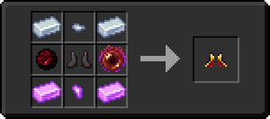

# 👟 Чоботи Полум'я

<figure><figcaption></figcaption></figure>

## Характеристики

\+3 Броня

\+3 Твердість броні

\+1 Опір відкидання

#### _Здібності_

Чоботи Полум'я при надяганні розблокує [_**Ультимейт-навичка**_ – Коса пекельного полум'я](kosa-plameni/#sposobnosti) **для предмета** [**Палаюча Коса**](kosa-plameni/)** .**


_**Рада**_**:** почніть з одержання [Палаючої Коси](kosa-plameni/), після чого купуйте інші сетові предмети для розблокування нових здібностей


## Отримання

#### _Крафт_

|                                                                                                                                                                                                                                                                                                                                                                                                                                                                                                                                                                                       | Чоботи Полум'я                                                                                         |
| ------------------------------------------------------------------------------------------------------------------------------------------------------------------------------------------------------------------------------------------------------------------------------------------------------------------------------------------------------------------------------------------------------------------------------------------------------------------------------------------------------------------------------------------------------------------------------------- | ------------------------------------------------------------------------------------------------------ |
| 
<a href="../../materialy/metally-i-mineraly/labradoritovyi-slitok.md">Лабрадоритовый слиток</a> + <a href="../../materialy/metally-i-mineraly/kusochek-labradorita.md">Кусочек лабрадорита</a> + <a href="../../materialy/amthirmis_lump.md">Кусок Амфирмиса</a> + Незеритовый нагрудник + <a href="../../materialy/blood_pearl_of_teleportation.md">Кровавая жемчужина</a> + <a href="../../materialy/metally-i-mineraly/kuncitovyi-slitok.md">Кунцитовый слиток</a> + <a href="../../materialy/metally-i-mineraly/kusochek-kuncita.md">Кусочек кунцита</a>
 |  |
