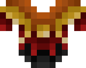
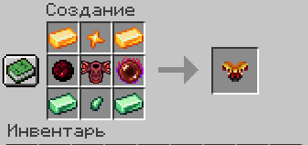

# 👕 Кіраса Полум'я

<figure><figcaption></figcaption></figure>

## Характеристики

\+8 Броня

\+3 Твердість броні

\+1 Опір відкидання

## Здібності

Кіраса Полум'я при надяганні розблокує [_**Навичку 2**_ – Палаючий стрибок](kosa-plameni/#sposobnosti) **для предмета** [**Палаюча Коса**](kosa-plameni/).\
**Також необхідний для розблокування** [_**Ультімейт-навички**_ – Коса пекельного полум'я](kosa-plameni/#sposobnosti) для предмета [Палаюча Коса](kosa-plameni/).


_**Порада**_**:** почніть з одержання [Палаючої Коси](kosa-plameni/), після чого купуйте інші сетові предмети для розблокування нових здібностей


## Отримання

#### _Крафт_

|                                                                                                                                                                                                                                                                                                                                                                                                                                                                                                                                                                               | Кіраса Полум'я                                                               |
| ----------------------------------------------------------------------------------------------------------------------------------------------------------------------------------------------------------------------------------------------------------------------------------------------------------------------------------------------------------------------------------------------------------------------------------------------------------------------------------------------------------------------------------------------------------------------------- | ---------------------------------------------------------------------------- |
| 
<a href="../../materialy/metally-i-mineraly/citrinovyi-slitok.md">Цитриновый слиток</a> + <a href="../../materialy/metally-i-mineraly/kusochek-citrina.md">Кусочек цитрина</a> + <a href="../../materialy/amthirmis_lump.md">Кусок Амфирмиса</a> + Незеритовый нагрудник + <a href="../../materialy/blood_pearl_of_teleportation.md">Кровавая жемчужина</a> + <a href="../../materialy/metally-i-mineraly/turmalinovyi-slitok.md">Турмалиновый слиток</a> + <a href="../../materialy/metally-i-mineraly/kusochek-turmalina.md">Кусочек турмалина</a>
 |  |
