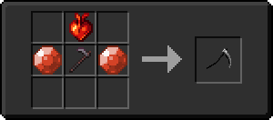
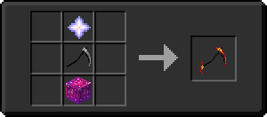
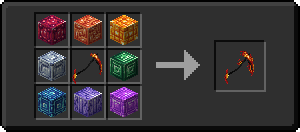

# 🗡 Палаюча Коса

Частина [комплекту Полум'я](../). Палаюча Коса може бути покращена до [Сяюча Коса Полум'я](./#siyayushaya-kosa-plameni).

<figure><figcaption>
Чотири стадії еволюції коси
</figcaption></figure>

## Характеристики

* 9 Шкода
* 1.6 Швидкість атаки
* Неруйнівний
* Не може бути знищено у вогні, лаві, блискавкою, за допомогою кактуса

## Особливості та обмеження

| Працює у _**PvP**_                            | :white\_check\_mark: |
| --------------------------------------------- | -------------------- |
| Працює у _**PvE**_                            | :white\_check\_mark: |
| Працює у _**Верхньому світі**_                | :white\_check\_mark: |
| Працює у _**Нижньому світі**_                 | :white\_check\_mark: |
| Працює у _**світі Енда**_                     | :white\_check\_mark: |
| Працює на _**босах**_                         | :white\_check\_mark: |
| Сумісно із _**кастомними чарами**_ (для меча) | :white\_check\_mark: |

## Здібності

* _**Пасивна**_ – Імунітет до вогню:\
  Несприйнятливість до шкоди від вогню та лави.


Для розблокування _**Пасивної**_ здібності необхідні чотири речі типу броні з [комплекту Полум'я](../)


* _**Базова атака**_ – Палаючий Удар (ЛКМ):\
  Здійснює удар, що рубає.\
  :boom: 4 Шкоди\
  :red\_circle: 1 Радіус\
  :hourglass: 1 сек. Кулдаун
* _**Навичка 1**_ – Пекельне колесо (ПКМ):\
  Обертає свою косу і спалює істот навколо себе.\
  :boom: 4 Шкоди\
  :fire: 4 сек. Шкода від вогню\
  :red\_circle: 4 Радіус\
  :hourglass: 2 сек. Кулдаун


Для розблокування _**Навички 1**_ необхідний [_Шолом Полум'я_](../shlem-plameni.md)


* _**Навичка 2**_ – Палаючий стрибок (Shift + ПКМ):\
  Здійснює стрибок вгору.\
  :hourglass: 3 сек. Кулдаун


Для розблокування _**Навички 2**_ необхідна [Кіраса Полум'я](../kirasa-plameni.md)


* _**Навичка 3**_ – Пекельні сфери (Shift + Shift):\
  Створює вогняні сфери, що обертаються, які підпалюють об'єкти при попаданні.\
  :boom: 5 Шкоди\
  :fire: 4 сек. Шкода від вогню\
  :red\_circle: 1 Радіус\
  :hourglass: 13 сек. Кулдаун


Для розблокування _**Навички 3**_ необхідні [Поножі Полум'я](../ponozhi-plameni.md)


* _**Ультімейт-навичка**_ – Коса пекельного полум'я (Shift + ЛКМ)**:**\
  **Базова атака \_Палаючий Удар**\_ замінюється на _**Інфернальний удар**_. На 10 секунд швидкість пересування та швидкість атаки збільшуються. Базові атаки стають більшими і сильнішими, спалюючи сутності при атаці.\
  :boom: 6 Шкоди\
  :fire: 4 сек. Шкода від вогню\
  :red\_circle: 1.5 Радіус\
  :hourglass: 20 сек. Кулдаун


Для розблокування _**Ультімейт-навички**_ необхідні [Кіраса Полум'я](../kirasa-plameni.md) та [Чоботи Полум'я](../botinki-plameni.md)


* _**Комбо-навичка**_ – Пекельний вихор (Shift + ПКМ – ПКМ):\
  Здійснює стрибок нагору і починає обертати свою косу, розбиваючи поверхню, викликаючи вибух.\
  :boom: 4 Шкоди\
  :fire: 4 сек. Шкода від вогню\
  :red\_circle: 6 Радіус\
  :hourglass: 8 сек. Кулдаун


Для розблокування _**Комбо-навички**_ необхідні чотири речі типу броні з [комплекту Полум'я](../)


## Отримання

#### _Крафт_

Крафт палаючої Коси складається з декількох етапів.

#### Згасла Коса

|                                                                                                                                                                           | Етап 1 (Згасла Коса)                                                                               |
| ------------------------------------------------------------------------------------------------------------------------------------------------------------------------- | -------------------------------------------------------------------------------------------------- |
| 
Незеритовая мотыга + <a href="../../../materialy/pristine_fire_gem.md">Чистый камень огня</a> + <a href="../../../materialy/sweet_heart.md">Сердце Лилит</a>
 |  |

#### Тускло горящая Коса

|                                                                                                                                                              | Этап 2 (Тускло горящая Коса)                                                                       |
| ------------------------------------------------------------------------------------------------------------------------------------------------------------ | -------------------------------------------------------------------------------------------------- |
| 
<a href="./#ugasshaya-kosa">Угасшая Коса</a> + Звезда незера + <a href="../../../bloki/dragonitovyi-blok-1.md">Улучшенный драгонитовый блок</a>
 |  |

#### Пылающая Коса

|                                                                                                                                                                                                                                                                                                                                                                                                                                                                                                                                                                                                                                                                | Этап 3 (Пылающая Коса)                                                                             |
| -------------------------------------------------------------------------------------------------------------------------------------------------------------------------------------------------------------------------------------------------------------------------------------------------------------------------------------------------------------------------------------------------------------------------------------------------------------------------------------------------------------------------------------------------------------------------------------------------------------------------------------------------------------- | -------------------------------------------------------------------------------------------------- |
| 
<a href="./#tusklo-goryashaya-kosa">Тускло горящая Коса</a> +

<a href="../../../bloki/dragonitovyi-blok.md">Драгонитовый блок</a> + <a href="../../../bloki/topazovyi-blok.md">Топазный блок</a> + <a href="../../../bloki/citrinovyi-blok.md">Цитриновый блок</a> + <a href="../../../bloki/turmalinovyi-blok.md">Турмалиновый блок</a> + <a href="../../../bloki/kuncitovyi-blok.md">Кунцитовый блок</a> + <a href="../../../bloki/tanzanitovyi-blok.md">Танзанитовый блок</a> + <a href="../../../bloki/sapfirovyi-blok.md">Сапфировый блок</a> + <a href="../../../bloki/labradoritovyi-blok.md">Лабрадоритовый блок</a>
 |  |
