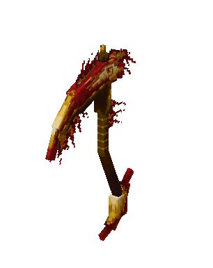

# 🗡 Сияющая Коса Пламени

Улучшенная версия [Пылающей Косы](./).

<figure><figcaption></figcaption></figure>

## Характеристики

* 11 Урон
* 1.4 Скорость атаки
* Неразрушаемый
* Не может быть уничтожено в огне, лаве, молнией, об кактус

## Особенности и ограничения

Те же, что у [Пылающей Косы](./).

## Способности

* _**Пассивная**_ – Иммунитет к огню:\
  Невосприимчивость к урону от огня и лавы.


Для разблокировки _**Пассивной**_ способности необходимы четыре вещи типа брони из [комплекта Пламени](../)


* _**Базовая атака**_ – Пылающий Удар (ЛКМ):\
  Совершает рубящий удар.\
  \
  :boom: 7 Урон\
  :red\_circle: 2 Радиус\
  :hourglass: 1 сек. Кулдаун
* _**Навык 1**_ – Адское колесо (ПКМ):\
  Вращает свою косу и сжигает существ вокруг себя.\
  \
  :boom: 7 Урон\
  :fire: 6 сек. Урон от огня\
  :red\_circle: 5 Радиус\
  :hourglass: 2 сек. Кулдаун


Для разблокировки _**Навыка 1**_ необходим [_Шлем Пламени_](../shlem-plameni.md)


* _**Навык 2**_– Пылающий прыжок (Shift + ПКМ):\
  Совершает прыжок вверх.\
  \
  :hourglass: 3 сек. Кулдаун


Для разблокировки _**Навыка 2**_ необходима [Кираса Пламени](../kirasa-plameni.md)


* _**Навык 3**_ – Адские сферы (Shift + Shift):\
  Создает вращающиеся огненные сферы, которые поджигают объекты при попадании.\
  \
  :boom: 8 Урон\
  :fire: 6 сек. Урон от огня\
  :red\_circle: 1 Радиус\
  :hourglass: 13 сек. Кулдаун


Для разблокировки _**Навыка 3**_ необходимы [Поножи Пламени](../ponozhi-plameni.md)


* _**Ультимейт-навык**_ – Коса адского пламени (Shift + ЛКМ)**:**\
  **Базовая атака **_**Пылающий Удар**_ заменяется на _**Инфернальный удар**_. На 10 секунд скорость передвижения и скорость атаки увеличиваются. Базовые атаки становятся больше и сильнее, сжигая сущности при атаке.\
  \
  :boom: 9 Урон\
  :fire: 5 сек. Урон от огня\
  :red\_circle: 3 Радиус\
  :hourglass: 15 сек. Кулдаун


Для разблокировки _**Ультимейт-навыка**_ необходимы [Кираса Пламени](../kirasa-plameni.md) и [Ботинки Пламени](../botinki-plameni.md)


* _**Комбо-навык**_ – Адский вихрь (Shift + ПКМ – ПКМ):\
  Совершает прыжок вверх и начинает вращать свою косу, разбивая поверхность, вызывая взрыв.\
  \
  :boom: 6 Урон\
  :fire: 5 сек. Урон от огня\
  :red\_circle: 7 Радиус\
  :hourglass: 6 сек. Кулдаун


Для разблокировки _**Комбо-навыка**_ необходимы четыре вещи типа брони из [комплекта Пламени](../)


## Получение

#### _Крафт_

Для крафта Сияющей Косы Пламени необходимо два предмета [Пылающая Коса.](./)

| ㅤ                                                                                                                                                                                                                                                                                                                                                                | Сияющая Коса Пламени                                                  |
| ---------------------------------------------------------------------------------------------------------------------------------------------------------------------------------------------------------------------------------------------------------------------------------------------------------------------------------------------------------------- | --------------------------------------------------------------------- |
| 
<a href="../../../materialy/izvechnyi-sattelit.md">Извечный саттелит</a> + <a href="../../../materialy/plastina-iz-chumnogo-yantarya.md">Пластина из чумного янтаря</a> + <a href="./">Пылающая Коса</a> + 

<a href="../../../materialy/pechat-karmy.md">Печать Кармы</a> + <a href="../../../materialy/gold_plate_0.md">Золотая плита</a>
 |  |
