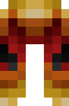
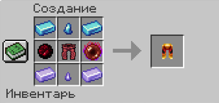

# 👖 Поножі Полум'я

<figure><figcaption></figcaption></figure>

## Характеристики

\+6 Броня

\+3 Твердість броні

\+1 Опір відкидання

## Здібності

Поножі Полум'я при надяганні розблокують [_**Навичку 3**_ – Пекельні сфери](kosa-plameni/#sposobnosti) **для предмета** [**Палаюча Коса**](kosa-plameni/)**.**


_**Порада**_**:** почніть з одержання [Палаючої Коси](kosa-plameni/), після чого купуйте інші сетові предмети для розблокування нових здібностей


## Отримання

#### _Крафт_

|                                                                                                                                                                                                                                                                                                                                                                                                                                                                                                                                                                               | Поножі Полум'я                                                               |
| ----------------------------------------------------------------------------------------------------------------------------------------------------------------------------------------------------------------------------------------------------------------------------------------------------------------------------------------------------------------------------------------------------------------------------------------------------------------------------------------------------------------------------------------------------------------------------- | ---------------------------------------------------------------------------- |
| 
<a href="../../materialy/metally-i-mineraly/sapfirovyi-slitok.md">Сапфировый слиток</a> + <a href="../../materialy/metally-i-mineraly/kusochek-sapfira.md">Кусочек сапфира</a> + <a href="../../materialy/amthirmis_lump.md">Кусок Амфирмиса</a> + Палаючі Поножі Лицаря + <a href="../../materialy/blood_pearl_of_teleportation.md">Кровавая жемчужина</a> + <a href="../../materialy/metally-i-mineraly/tanzanitovyi-slitok.md">Танзанитовый слиток</a> + <a href="../../materialy/metally-i-mineraly/kusochek-tanzanita.md">Кусочек танзанита</a>
 |  |
