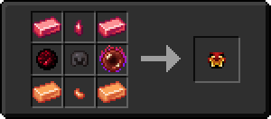

# 🎩 Шолом Полум'я

<figure><figcaption></figcaption></figure>

## Характеристики

\+3 Броня

\+3 Твердість броні

\+1 Опір відкидання

## Здібності

Шолом Полум'я при надяганні розблокує [_**Навичка 1**_ – Пекельне колесо](kosa-plameni/#sposobnosti) **для предмета** [**Палаюча Коса**](kosa-plameni/)**.* *


_**Рада**_**:** почніть з одержання [Палаючої Коси](kosa-plameni/), після чого купуйте інші сетові предмети для розблокування нових здібностей


## Отримання

#### _Крафт_

|                                                                                                                                                                                                                                                                                                                                                                                                                                                                                                                                                                      | Шолом Полум'я                                                                                           |
| -------------------------------------------------------------------------------------------------------------------------------------------------------------------------------------------------------------------------------------------------------------------------------------------------------------------------------------------------------------------------------------------------------------------------------------------------------------------------------------------------------------------------------------------------------------------- | ------------------------------------------------------------------------------------------------------- |
| 
<a href="../../materialy/metally-i-mineraly/dragonitovyi-slitok.md">Драгонитовый слиток</a> + <a href="../../materialy/metally-i-mineraly/kusochek-dragonita.md">Кусочек драгонита</a> + <a href="../../materialy/amthirmis_lump.md">Кусок Амфирмиса</a> + Незеритовый шлем + <a href="../../materialy/blood_pearl_of_teleportation.md">Кровавая жемчужина</a> + <a href="../../materialy/metally-i-mineraly/topazovyi-slitok.md">Топазовый слиток</a> + <a href="../../materialy/metally-i-mineraly/kusochek-topaza.md">Кусочек топаза</a>
 |  |
