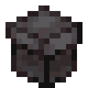

# Мифический подарок

<figure><figcaption></figcaption></figure>

## Получение

#### _Нестабильный пресс_

Для получения мифического подарка необходимо положить в нестабильный пресс, который можно найти на `/spawn`, [мифический кокон](../../materialy/chrysalis\_mythical.md).

<figure><figcaption></figcaption></figure>

## Использование

#### _Обмен_

Мифический подарок можно обменять на [закрытый мифический подарок](gift\_mythical\_advance.md).
