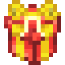

# Закрытый редкий подарок

<figure><figcaption></figcaption></figure>

## Получение

#### _Обмен_

Чтобы получить закрытый редкий подарок, нужно обменять [редкий подарок](./). Сделать это можно в `/shop` в комнате <mark style="color:purple;">Особое</mark>.&#x20;


Вы не сможете открыть этот подарок без [ключа от закрытого редкого подарка](rare\_key.md)

