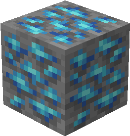
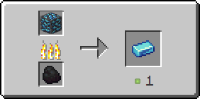

# Сапфірова руда

Сапфірова руда генерується тільки у Верхньому світі у [певних біомах](sapfirovaya-ruda.md#u-yakikh-biomakh) у вигляді скупчень, що складаються з одного – двох блоків.

<figure><figcaption>
Сапфировая руда/ Сапфироносный глубинный сланец 
</figcaption></figure>

## Генерація

### У яких біомах?

* [Теплий океан](https://minecraft.fandom.com/uk/wiki/%D0%9E%D0%BA%D0%B5%D0%B0%D0%BD) 🔗
* [Помірний океан](https://minecraft.fandom.com/uk/wiki/%D0%9E%D0%BA%D0%B5%D0%B0%D0%BD) 🔗
* [Глибокий помірний океан](https://minecraft.fandom.com/uk/wiki/%D0%9E%D0%BA%D0%B5%D0%B0%D0%BD) 🔗

### На якій висоті?

* Від 30 до -20

### Який шанс генерації у чанці?

* 10%

## Отримання

### Руйнування

Сапфірова руда видобувається лише алмазним чи незеритовим кайлом, у результаті випаде рудний сапфір.


Інструменти із зачаруванням _**Удача**_** ** не працюватимуть на сапфіровій руді



Інструменти із зачаруванням _**Шовковий дотик**_ видобуватимуть сапфірову руду замість рудного сапфіру


## Використання

#### _Плавлення_

Можна переплавити у печі, отримавши сапфіровий злиток.

<figure><figcaption></figcaption></figure>
