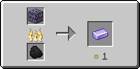

# Танзанітова руда

Танзанітова руда генерується лише у Краї як скупчень, що з одного — двох блоків.

<figure><figcaption>
Танзанітова руда/ Танзанітоносний глибинний сланець
</figcaption ></figure>

## Генерація

#### На якій висоті?

* Від 280 до 20

#### Який шанс генерації у чанці?

* 20%

## Отримання

#### _Руйнування_

Танзанітова руда видобувається лише алмазною чи незеритовою киркою.


Інструменти із зачаруванням _**Удача**_** ** не працюватимуть на танзанітовій руді



Інструменти із зачаруванням _**Шовковий дотик**_ видобуватимуть танзанітову руду замість [рудного танзаніту](../materialy/metally-i-mineraly/rudnyi-tanzanit.md)


## Використання

#### _Переплавка_

Можна переплавити в печі, отримавши [танзанітовий злиток](../materialy/metally-i-mineraly/tanzanitovyi-slitok.md).

<figure><figcaption></figcaption></figure>