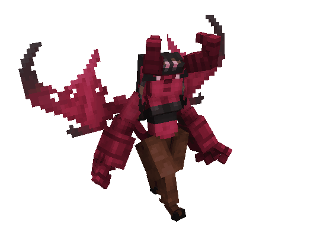

# 👿 Дитя Лилит


Информация о мобе обновляется. Характеристики и механика могут быть изменены


Кастомный моб, которого можно найти в Нижнем мире.

<figure><figcaption></figcaption></figure>

## Способности

<figure><figcaption></figcaption></figure>

## Спаун

Дитя Лилит спаунится в центре арены каждые 1.5 часа после своей смерти. Портал к ней можно найти в Нижнем мире на координатах между `X:-1800 Z:-1900` и `X:200 Z:1400`.

## Дроп

* [Сердце Лилит](../../materialy/sweet\_heart.md)
* от 4 до 8 магмы
* от 2 до 6 огненного порошка
* от 1 до 2 золотых зачарованных яблока
* от 16 до 32 пузырька опыта
* 12 900 опыта

