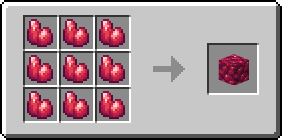
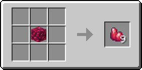

# Блок рудного драгонита

Это блок, равный 9 единицам [рудного драгонита](../materialy/metally-i-mineraly/rudnyi-dragonit.md).

<figure><figcaption></figcaption></figure>

## Получение

#### _Разрушение_

Блок рудного драгонита добывается только алмазной или незеритовой киркой.

#### _Крафт_

<figure><figcaption></figcaption></figure>

## Использование

Блоки рудного драгонита используются для компактного хранения [рудного драгонита](../materialy/metally-i-mineraly/rudnyi-dragonit.md).

## Как ингредиент при крафте

<figure><figcaption></figcaption></figure>
