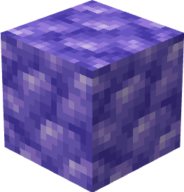

# Блок рудного танзанита

Это блок, равный 9 единицам [рудного танзанита](../materialy/metally-i-mineraly/rudnyi-tanzanit.md).

<figure><figcaption></figcaption></figure>

## Получение

#### _Разрушение_

Блок рудного танзанита добывается только алмазной или незеритовой киркой.

#### _Крафт_

<figure><figcaption></figcaption></figure>

## Использование

Блоки рудного танзанита используются для компактного хранения [рудного танзанита](../materialy/metally-i-mineraly/rudnyi-tanzanit.md).

## Как ингредиент при крафте

<figure><figcaption></figcaption></figure>
