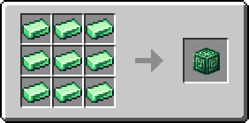
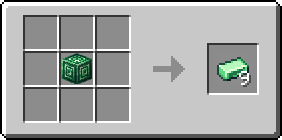

# Турмалиновый блок

Блок, который можно получить из 9 [турмалиновых слитков](../materialy/metally-i-mineraly/turmalinovyi-slitok.md), и наоборот. Используется для компактного хранения [турмалиновых слитков](../materialy/metally-i-mineraly/turmalinovyi-slitok.md) и в постройках.

<figure><figcaption></figcaption></figure>

## Получение

#### _Разрушение_

Турмалиновый блок добывается только алмазной или незеритовой киркой.

#### _Крафт_

<figure><figcaption></figcaption></figure>

## Использование

Турмалиновый блок можно превратить в [турмалиновые слитки](../materialy/metally-i-mineraly/turmalinovyi-slitok.md).

## Как ингредиент при крафте

<figure><figcaption></figcaption></figure>
