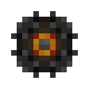

# Модуль памяти 2 ур.

<figure><figcaption></figcaption></figure>

## Получение

#### _Крафт_

| ㅤ                                                                                                                                                                                                                                    | Модуль памяти 2 ур.                          |
| ------------------------------------------------------------------------------------------------------------------------------------------------------------------------------------------------------------------------------------ | -------------------------------------------- |
| 
<a href="purple_blaze.md">Фиолетовое пламя</a> + <a href="materialy-yaica/256k.md">Модуль памяти 1 ур.</a> + <a href="spawner_seeker.md">Пространственное ядро</a> + <a href="enderite_ingot.md">Слиток эндерита</a>
 |  |

## Использование

#### _Как ингредиент при крафте_

#### [Модуль памяти 3 ур.](65536k\_fluid.md)

| ㅤ                                                                                                                                                                                                                            | Модуль памяти 3 ур.                          |
| ---------------------------------------------------------------------------------------------------------------------------------------------------------------------------------------------------------------------------- | -------------------------------------------- |
| 
<a href="purple_blaze.md">Фиолетовое пламя</a> + <a href="16384k_fluid.md">Модуль памяти 2 ур.</a> + <a href="spawner_seeker.md">Пространственное ядро</a> + <a href="enderite_ingot.md">Слиток эндерита</a>
 |  |
