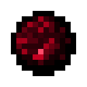

# Кусок Амфирмиса

<figure><figcaption></figcaption></figure>

## Получение

#### _Крафт_

| ㅤ                                                                                                         |  Кусок Амфирмиса                               |
| --------------------------------------------------------------------------------------------------------- | ---------------------------------------------- |
| 
<a href="karos_lump.md">Кусок Кароса</a> + Алмаз + <a href="fury_fire.md">Яростный огонь</a>
 |  |

## Использование

#### _Как ингредиент при крафте_

#### [Кусок Цермила](cermile_lump.md)

| ㅤ                                                                                                                |  Кусок Цермила                               |
| ---------------------------------------------------------------------------------------------------------------- | -------------------------------------------- |
| 
<a href="amthirmis_lump.md">Кусок Амфирмиса</a> + Алмаз + <a href="fury_fire.md">Яростный огонь</a>
 |  |

