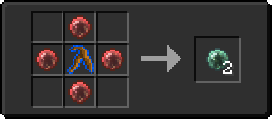
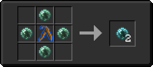

# Сфера крови ученика

<figure><figcaption></figcaption></figure>

## Получение

#### _Крафт_

| ㅤ                                                                                                                           |  Сфера крови ученика                              |
| --------------------------------------------------------------------------------------------------------------------------- | ------------------------------------------------- |
| 
<a href="weakbloodorb.md">Слабая сфера крови</a> + <a href="divining_rod_3.md">Великолепная волшебная палочка</a>
 |  |

## Использование

#### _Как ингредиент при крафте_

#### [Кровавый шар мага](magicianbloodorb.md)

| ㅤ                                                                                                                                  |  Кровавый шар мага                              |
| ---------------------------------------------------------------------------------------------------------------------------------- | ----------------------------------------------- |
| 
<a href="apprenticebloodorb.md">Сфера крови ученика</a> + <a href="divining_rod_3.md">Великолепная волшебная палочка</a>
 |  |

