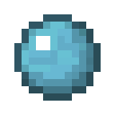
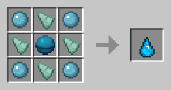

# Водяной шар

<figure><figcaption></figcaption></figure>

## Получение

#### _Крафт_

| ㅤ                                        |  Водяной шар                              |
| ---------------------------------------- | ----------------------------------------- |
| 
Бутылочка воды + Сгусток слизи
 |  |

## Использование

#### _Как ингредиент при крафте_

#### [Водный слиток](aquatic_ingot.md)

| ㅤ                                                                |  Водный слиток                                |
| ---------------------------------------------------------------- | --------------------------------------------- |
| 
Сгусток магмы + <a href="aqua_ball.md">Водяной шар</a>
 |  |

#### [Аква](aqua.md)

| ㅤ                                                                                      |  Аква                               |
| -------------------------------------------------------------------------------------- | ----------------------------------- |
| 
<a href="aqua_ball.md">Водяной шар</a> + Осколок призмарина + Сердце моря
 |  |

