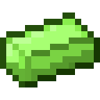

# Слиток арлемита

<figure><figcaption></figcaption></figure>

## Получение

#### _Крафт_

|                                                        |  Слиток арлемита                               |
| ------------------------------------------------------ | ---------------------------------------------- |
| 
<a href="arlemite_nugget.md">Кусок арлемита</a>
 |  |

## Использование

#### _Как ингредиент при крафте_

#### [Кристалл опыта 1 ур.](xp_crystal_0.md)

|                                                                                                            |  Кристалл опыта 1 ур.                         |
| ---------------------------------------------------------------------------------------------------------- | --------------------------------------------- |
| 
<a href="purple_blaze.md">Фиолетовое пламя</a> + <a href="arlemite_ingot.md">Слиток арлемита</a>
 |  |

